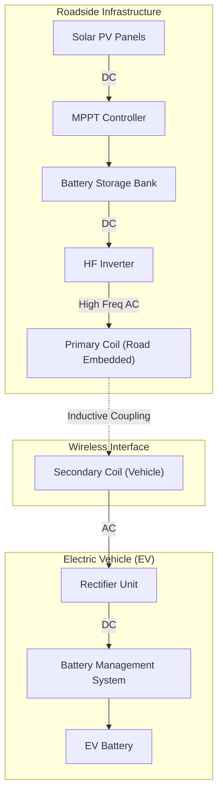

# Solar-Powered Dynamic Wireless EV Charging System

## 📄 Project Abstract
This project presents the design and feasibility analysis of a **Dynamic Wireless Charging System (DWCS)** for Electric Vehicles (EVs). Unlike static charging stations, this infrastructure embeds inductive power transfer coils directly into roadways, allowing vehicles to charge *while in motion*. The system is powered by a renewable solar grid with battery backup, aiming to solve the critical issues of **Range Anxiety** and **Charging Downtime** in the EV sector.

> **Status:** Completed Engineering Case Study (Verzeo Internship)
> **Domain:** Renewable Energy | Power Electronics | Smart Grid

## 📐 System Architecture
The system utilizes **Inductive Power Transfer (IPT)**. It converts solar DC energy into high-frequency AC, creates a magnetic field via a primary coil in the road, and induces current in a secondary coil attached to the vehicle.

### Power Flow Logic
1.  **Generation:** Solar PV Array captures energy -> MPPT Controller optimizes output.
2.  **Storage:** Energy is stored in a Battery Bank (for night/cloudy operation).
3.  **Transmission (Roadside):** * DC -> High-Frequency Inverter.
    * Primary Coil (Transmitter) creates an oscillating magnetic field.
4.  **Reception (Vehicle Side):**
    * Secondary Coil (Receiver) captures magnetic flux.
    * AC -> DC Rectifier converts current.
    * Charge Controller regulates voltage for the EV Battery.

## 📊 Technical Diagram

